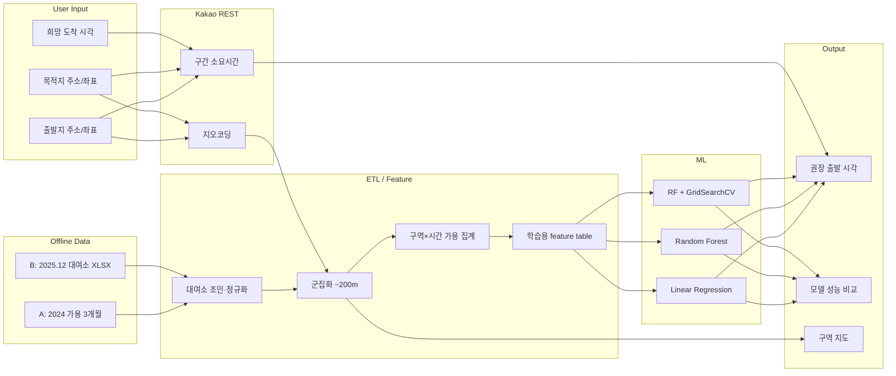
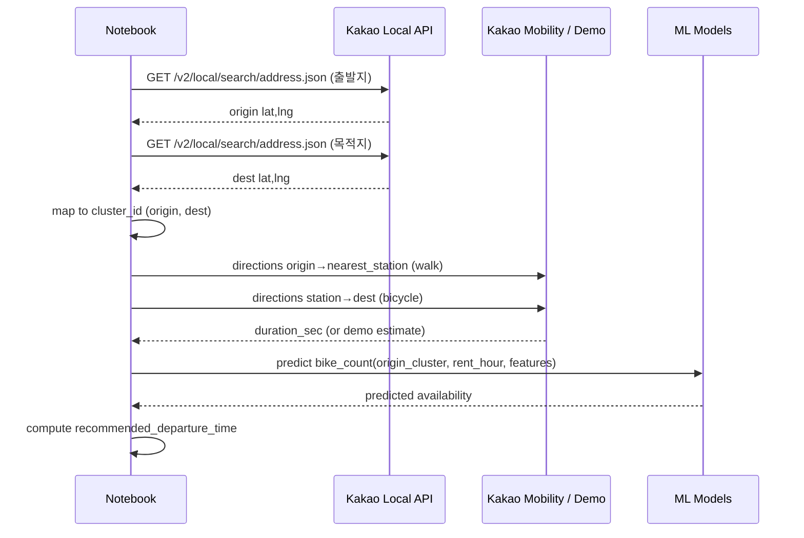

# Tech Spec: 집에서 언제 출발해야 따릉이를 탈 수 있을까?

| 항목 | 내용 |
|------|------|
| 문서 버전 | 0.2 (승인) |
| 작성일 | 2026-06-18 |
| 승인일 | 2026-06-18 |
| 상위 문서 | `prd.md` v0.2 (승인) |
| 상태 | **승인 완료** — 3단계 `tasks.md`는 별도 지시 후 착수 |

---

## 1. 개요

### 1.1 목적

본 문서는 PRD v0.2를 구현 가능한 수준으로 구체화한다. 다루는 범위:

- 데이터 스키마·읽기 인코딩·병합·집계 파이프라인
- 약 200m **구역(군집)** 정의 및 가용성 매핑
- 선형 회귀 / Random Forest / RF 하이퍼파라미터 튜닝 설계
- 카카오맵(REST) API 연동 및 **권장 출발 시각** 산출 로직
- Jupyter Notebook 섹션 구조 및 산출물·환경 설정

### 1.2 시스템 구성 (논리)



### 1.3 저장소·산출물 경로

| 경로 | 용도 | 인코딩 |
|------|------|--------|
| `data/` | 원본 CSV/XLSX (읽기 전용) | cp949 / utf-8-sig (§2) |
| `data/processed/` | 조인·집계 중간 CSV/Parquet | **UTF-8** |
| `models/` | 학습된 모델 pickle/joblib | 바이너리 |
| `notebooks/` | Jupyter Notebook | **UTF-8** (`.ipynb` JSON) |
| `.env` | API 키 (Git 제외) | **UTF-8** |
| `.env.example` | 키 템플릿 | **UTF-8** |
| `docs/` | 탐색·UAT 보고서 | **UTF-8** |

---

## 2. 인코딩 정책

PRD Constitution 1.3을 기술 수준에서 고정한다.

### 2.1 원본 데이터 — 읽기 전용

| 파일 | 경로 패턴 | 읽기 인코딩 | 비고 |
|------|-----------|-------------|------|
| A. 2024 가용 수량 | `data/2024년 .../data_24{MM}.csv` | **`cp949`** | `utf-8-sig` 시도 시 실패 확인 |
| B. 2025 대여소 XLSX | `data/2025년 .../공공자전거 대여소 정보(25.12월 기준).xlsx` | **openpyxl 기본** | 상단 5행 스킵 후 파싱 (§3.2) |
| (미사용) 마스터 CSV | `.../서울시 공공자전거 따릉이 대여소 마스터 정보.csv` | `cp949` | v1 보조 룩업만, 필수 아님 |

```python
# A 데이터 읽기 표준
pd.read_csv(path, encoding="cp949", dtype=str, chunksize=100_000)
```

### 2.2 프로젝트 산출물 — UTF-8 저장 (필수)

- `techspec.md`, `tasks.md`, `docs/**/*.md`, `*.py`, `*.ipynb`, `requirements.txt`, `.env.example`
- `data/processed/*` — 한글 컬럼명 포함 CSV 저장 시 **`encoding="utf-8"`** (필요 시 `utf-8-sig` for Excel 호환)
- Notebook에서 파일 쓰기: `open(..., encoding="utf-8")` / `df.to_csv(..., encoding="utf-8")`

### 2.3 구현 시 자가 검증

1. 한글 포함 파일 저장 직후 Cursor에서 열어 깨짐 없음 확인
2. `python -c "Path('techspec.md').read_text(encoding='utf-8')"` 통과

---

## 3. 데이터 스키마

### 3.1 A — 2024 1시간 단위 가용 수량 (Primary)

**파일**: `data_2401.csv`, `data_2404.csv`, `data_2407.csv`

| 컬럼 (원본) | 타입 | 설명 | 파생 |
|-------------|------|------|------|
| `일시` | date (`YYYY-MM-DD`) | 관측 일반 **일자** (월별 파일 내 동일일 반복) | `date`, `month`, `season` |
| `대여소번호` | string | 5자리 zero-pad (`00101`) | `station_no_norm` (§3.3) |
| `대여소명` | string | 대여소 명칭 | 조인 검증용 |
| `시간대` | int 0-23 | 해당 **시간**의 스냅샷 | `hour` |
| `거치대수량` | int ≥ 0 | 가용(거치) 자전거 대수 | **`target`: `bike_count`** |

**행 단위**: `(date, station_no, hour)` 당 1행.

**주의**: `일시`는 파일명 월과 불일치 가능(예: 2401 파일도 `2024-01-01`부터). **`date` 파생은 `일시` 컬럼 기준**, `season`/`month`는 `date`에서 추출.

### 3.2 B — 2025.12 대여소 정보 (Auxiliary)

**파일**: `공공자전거 대여소 정보(25.12월 기준).xlsx`

**파싱 규칙**

```python
raw = pd.read_excel(path, header=None)
df = raw.iloc[5:].copy()
df.columns = [
    "station_no", "station_name", "district", "address",
    "lat", "lng", "installed_at", "lcd_slots", "qr_slots", "op_mode",
]
df = df.dropna(subset=["station_no"])
```

| 컬럼 | 타입 | 설명 |
|------|------|------|
| `station_no` | string/int | 대여소 번호 (`102`, `301`, …) |
| `station_name` | string | 명칭 (앞 공백 trim) |
| `district` | string | 자치구 |
| `address` | string | 상세주소 |
| `lat`, `lng` | float | WGS84 |
| `qr_slots` | int | QR 거치대수 (용량 proxy) |

파생: `station_no_norm` (§3.3)

### 3.3 조인 키 정규화

```python
import re

def norm_station_no(value) -> str:
    s = str(value).strip().strip('"')
    digits = re.sub(r"\D", "", s)
    return digits.lstrip("0") or "0"
```

| 규칙 | 예시 |
|------|------|
| 비숫자 제거 | `"00101"` → `"101"` |
| 선행 0 제거 | `"02183"` → `"2183"` |
| A ↔ B 조인 | `left_on=station_no_norm`, `inner` join |
| 미매칭 A 행 | **제외** (PRD §4.5, 매칭률 ?87%) |

조인 후 검증 태스크: 매칭률·미매칭 건수를 Notebook/ `docs/`에 기록.

### 3.4 병합·집계 스키마 (Processed)

#### `data/processed/stations.csv`

| 컬럼 | 설명 |
|------|------|
| `station_no_norm` | PK |
| `station_name`, `district`, `address`, `lat`, `lng`, `qr_slots` | B에서 |
| `cluster_id` | 군집 ID (§4) |
| `cluster_lat`, `cluster_lng` | 구역 중심 |

#### `data/processed/availability_station_hour.csv`

월별 ETL 후 **`pd.concat`** (3개월). 청크 로드로 생성.

| 컬럼 | 설명 |
|------|------|
| `date`, `hour`, `station_no_norm` | |
| `bike_count` | 원본 `거치대수량` |
| `month`, `dow`, `is_weekend`, `season` | 파생 |
| `cluster_id` | stations 조인 |

#### `data/processed/availability_zone_hour.csv` (학습용 집계)

| 컬럼 | 설명 |
|------|------|
| `date`, `hour`, `cluster_id` | PK 조합 |
| `bike_count_mean` | 구역 내 대여소 평균 거치대수 |
| `bike_count_max` | 구역 내 최대 (보수적 가용) |
| `availability_rate` | `bike_count_mean > 0` 비율 (대여소별 평균) |
| `month`, `dow`, `is_weekend`, `season` | |

**타깃 변수 (회귀)**: `bike_count_mean` (기본). Notebook에 `bike_count_max` 보조 실험 optional.

---

## 4. ETL 파이프라인

### 4.1 처리 원칙

- **전량 한 번에 로드 금지** — `chunksize=100_000` 청크 또는 `usecols` + `dtype` 최적화
- 월별 파일 **순차 처리 → 즉시 집계 → 메모리 해제**
- 재실행 시 `data/processed/` 캐시 재사용 (Notebook 상단 `REBUILD=False` 플래그)

### 4.2 ETL 단계

```
[1] load_stations(B) → stations.csv
[2] for each month in [2401, 2404, 2407]:
      chunk-read A → norm station_no → inner join stations
      → append availability_station_hour (month)
[3] aggregate by (date, hour, cluster_id) → availability_zone_hour.csv
[4] feature engineering → ml_train.csv
```

### 4.3 `season` 매핑

| season | month (`date`) |
|--------|----------------|
| `winter` | 12, 1, 2 |
| `spring` | 3, 4, 5 |
| `summer` | 6, 7, 8 |
| `fall` | 9, 10, 11 |

---

## 5. 군집화 (ML-01)

### 5.1 목표

- 시작/도착 지점을 **최대 약 200m** 범주의 **구역(cluster)** 으로 표현
- 구역별·시간별 따릉이 가용 패턴 매핑 (ML-02)

### 5.2 알고리즘

**1차: `AgglomerativeClustering` (haversine, distance threshold)**

| 파라미터 | 값 | 근거 |
|----------|-----|------|
| `metric` | `haversine` | 위경도 거리 |
| `linkage` | `average` | 구역 형태 완만 |
| `distance_threshold` | `200 / 6371000` rad | 지표면 200m |
| `n_clusters` | `None` | threshold 기반 자동 |

입력: `X = np.radians(stations[["lat", "lng"]])`

**2차 (검증)**: 구역 내 최대 쌍wise 거리 > 200m 이면 재분할 — Notebook에서 **구역 직경 histogram** 보고.

**대안 (AC 충족용)**: DBSCAN `eps=200/6371000`, `min_samples=1`, `metric=haversine` — 결과 비교 표 1행 optional.

### 5.3 사용자 좌표 → 구역 매핑

1. 카카오 지오코딩으로 `(lat, lng)` 획득
2. haversine 거리 최소 `cluster_id` 할당 (200m 초과 시 **가장 가까운 구역** + 거리 경고 출력)

### 5.4 시각화

- **folium** 지도: 대여소 점 + 구역 중심 + Voronoi/원(반경 200m) overlay
- 출발·도착 구역 하이라이트 (UAT-2)

---

## 6. 머신러닝 설계 (ML-03 ~ ML-05)

### 6.1 문제 정식화

**회귀**: 구역 `cluster_id`에서 **특정 시각의 예상 거치대수** 예측.

\[
\hat{y} = f(\text{hour}, \text{dow}, \text{month}, \text{season}, \text{cluster_id}, \text{is\_weekend}, \ldots)
\]

**의사결정 (권장 출발 시각)** — §7.4

### 6.2 Feature

| feature | 타입 | 처리 |
|---------|------|------|
| `hour` | numeric | 0-23 |
| `dow` | numeric | 0-6 |
| `is_weekend` | binary | |
| `month` | numeric | 1-12 |
| `season` | categorical | one-hot |
| `cluster_id` | categorical | one-hot 또는 target encoding (RF는 native categorical via one-hot) |

**선형 회귀용**: `StandardScaler` + one-hot (`ColumnTransformer`)

**RF용**: one-hot 동일 (구현 단순화); 트리 깊이로 상호작용 학습.

### 6.3 Train / Test 분할

- **Time-based holdout**: 각 월의 **마지막 7일** → test, 나머지 → train  
  (3개월 합산 후에도 동일 규칙 — **미래 누수 방지**)
- 또는 `2407` 전체를 test, `2401+2404` train — Notebook에 **선택 근거** 명시

### 6.4 모델

| ID | 모델 | sklearn | 비고 |
|----|------|---------|------|
| ML-03 | 선형 회귀 | `LinearRegression` | `Pipeline(scaler + ohe + LR)` |
| ML-04 | Random Forest | `RandomForestRegressor(n_estimators=100, random_state=42)` | 동일 X |
| ML-05 | RF 튜닝 | `GridSearchCV` 또는 `RandomizedSearchCV` | 아래 탐색 공간 |

**튜닝 탐색 공간 (GridSearchCV)**

```python
param_grid = {
    "model__n_estimators": [100, 200],
    "model__max_depth": [None, 12, 20],
    "model__min_samples_leaf": [1, 2, 5],
    "model__max_features": ["sqrt", 0.5],
}
# cv=3, scoring="neg_mean_absolute_error"
```

튜닝 **전** = ML-04 default, **후** = best_estimator_ — 동일 test set으로 MAE/RMSE/R² 비교 (UAT-3).

### 6.5 평가 지표

| 지표 | 용도 |
|------|------|
| **MAE** | 주 지표 (대수 단위 해석 용이) |
| **RMSE** | 이상치 패널티 |
| **R²** | 설명력 |

Notebook 출력: 표 + 잔차 plot (hour vs residual) optional.

### 6.6 클래스 불균형

`bike_count=0` 비율이 높을 수 있음 → 회귀 타깃 유지 (PRD purpose). 보조로 **분류(가용 yes/no)** 는 optional, 필수 아님.

---

## 7. 카카오맵 API 및 권장 출발 시각

### 7.1 환경 변수 (`.env`)

```env
# 필수 — Kakao Developers REST API 키 (Local)
KAKAO_REST_API_KEY=your_rest_api_key_here

# 선택 — Kakao Mobility 길찾기 (없으면 §7.3 demo 모드)
KAKAO_MOBILITY_API_KEY=
```

`.env.example` 동일 키 이름, 값은 placeholder. `.gitignore`에 `.env` 포함.


**카카오 API 키 운영**: 구현 및 Notebook 실행 단계에서 카카오 REST/Mobility 키가 필요하면 **사용자에게 직접 요청**한다. 에이전트가 임의로 키를 생성·추정하지 않는다.

### 7.2 API 흐름



### 7.3 엔드포인트

| 단계 | API | URL | 모드 |
|------|-----|-----|------|
| 지오코딩 | Local REST | `https://dapi.kakao.com/v2/local/search/address.json?query={address}` | Header: `Authorization: KakaoAK {KAKAO_REST_API_KEY}` |
| 길찾기 (우선) | Mobility Directions | `https://apis-navi.kakaomobility.com/v1/directions` | `KAKAO_MOBILITY_API_KEY`, 좌표 `x=lng,y=lat` |
| **Demo fallback** | haversine + 속도 | — | Mobility 키 없음/API 실패 시 |

**Demo fallback 속도 (고정)**

| 구간 | 이동 수단 | 속도 |
|------|-----------|------|
| 집 → 출발 구역 최근접 대여소 | 도보 | 4.5 km/h |
| 대여소 → 목적지 | 자전거 | 15 km/h |

```python
def haversine_m(lat1, lon1, lat2, lon2) -> float: ...
duration_sec = distance_m / speed_mps
```

Notebook 실행 시 **API / Demo** 중 어떤 모드인지 stdout에 명시 (UAT-4).

### 7.4 권장 출발 시각 알고리즘

**입력**

- `origin_address`, `dest_address`
- `target_arrival`: datetime (목적지 **도착** 희망 시각)
- `min_bikes`: int (기본 1)

**단계**

1. 지오코딩 → `origin`, `dest` 좌표
2. `origin` → `cluster_origin`, `dest` → `cluster_dest`
3. `nearest_station` = cluster_origin 내 출발지와 haversine 최소 대여소
4. `walk_sec` = API/demo( origin → nearest_station )
5. `bike_sec` = API/demo( nearest_station → dest ) — 또는 dest 구역 대표점
6. `rent_time` = `target_arrival` - `bike_sec` (대여 시각)
7. `depart_home` = `rent_time` - `walk_sec`
8. `hour`, `dow`, … = `rent_time`에서 추출
9. 3개 모델로 `predict(origin_cluster, features)` → `pred_bikes`
10. `pred_bikes >= min_bikes` 이면 **`depart_home`** 출력; 미달 시 **1시간 전**으로 `rent_time` 조정 반복(최대 6회) 또는 “해당 조건 어려움” 메시지

**출력 예**

```
권장 집 출발 시각: 2024-04-15 08:12
예상 대여 시각(대여소 도착): 2024-04-15 08:35
예상 거치대수(Linear / RF / Tuned RF): 3.2 / 4.1 / 3.8
소요시간: 도보 23분 + 자전거 42분 (Kakao API)
```

---

## 8. Jupyter Notebook 구조

**파일**: `notebooks/ddareungi_departure_prediction.ipynb` (UTF-8 JSON)

| # | 섹션 | 내용 |
|---|------|------|
| 0 | Setup | imports, paths, `REBUILD`, `.env` 로드 (`python-dotenv`) |
| 1 | Data Load & ETL | §4 파이프라인, processed 캐시 |
| 2 | EDA | 월/시간대별 가용 분포, 결측·0 비율 |
| 3 | Clustering | §5, folium 지도 저장/표시 |
| 4 | Feature Table | `ml_train.csv` 생성 |
| 5 | Train/Test Split | §6.3 |
| 6 | Linear Regression | ML-03, metrics |
| 7 | Random Forest | ML-04, metrics |
| 8 | RF Hyperparameter Tuning | ML-05, before/after 표 |
| 9 | Model Comparison | UAT-3 차트 |
| 10 | Kakao API Helpers | §7, geocode + duration |
| 11 | **User Input & Prediction** | `ipywidgets` 또는 `input()` — §7.4 |
| 12 | Summary | 결론·한계 |

**사용자 입력 (NB-01)**

- **권장**: `ipywidgets` (Text + DatePicker + Button)
- **대체**: `input()` — API 키 없는 교육 환경

---

## 9. 의존성 (`requirements.txt` 초안)

```
pandas>=2.0
numpy>=1.24
scikit-learn>=1.3
openpyxl>=3.1
matplotlib>=3.7
seaborn>=0.13
folium>=0.15
requests>=2.31
python-dotenv>=1.0
jupyter>=1.0
ipywidgets>=8.0
joblib>=1.3
```

`seaborn` — optional EDA. 구현 시 확정.

---

## 10. 보안·운영

| 항목 | 규칙 |
|------|------|
| API 키 | `.env` only, Git 제외 |
| API 실패 | Demo fallback + 사용자 알림 |
| Rate limit | 요청 간 `time.sleep(0.1)`, 실패 시 retry 2회 |
| 재현성 | `random_state=42` 고정 |

---

## 11. PRD 요구사항 추적

| PRD ID | Tech Spec | 검증 |
|--------|-----------|------|
| ML-01 | §5 | UAT-2 |
| ML-02 | §3.4, §4 | Notebook 집계 |
| ML-03 | §6.4 | UAT-3 |
| ML-04 | §6.4 | UAT-3 |
| ML-05 | §6.4 | UAT-3 |
| MAP-01 | §7 | UAT-4 |
| NB-01 | §8 #11 | UAT-1 |
| C-05 | §2 | UAT-6 |
| C-04 | §4.1 | ETL 청크 |

---

## 12. 한계·가정 (v1)

- 2024 가용 데이터 + 2025.12 좌표 조인 — **시점 불일치** 존재 (미매칭 13% 제외)
- 실시간 가용이 아닌 **과거 패턴 기반** 예측
- 날씨·공휴일·이벤트 미반영 (PRD Out of Scope)
- Mobility API 미보유 시 Demo 거리·속도 추정 사용 — 보고서에 명시

---

## 13. 검수 기록 (확정)

| # | 항목 | 결정 |
|---|------|------|
| 1 | 군집화: AgglomerativeClustering haversine 200m | **승인** |
| 2 | 타깃 변수: `bike_count_mean` (구역 평균) | **승인** |
| 3 | Train/Test: 월별 마지막 7일 holdout | **승인** |
| 4 | 카카오: Mobility API + Demo fallback | **승인** — 키 필요 시 사용자에게 요청 |
| 5 | Notebook: `notebooks/ddareungi_departure_prediction.ipynb` | **승인** |

---

*본 문서는 UTF-8로 저장되었습니다. Tech Spec v0.2 승인 완료. 3단계 `tasks.md` 작성은 별도 지시 후 진행합니다.*
